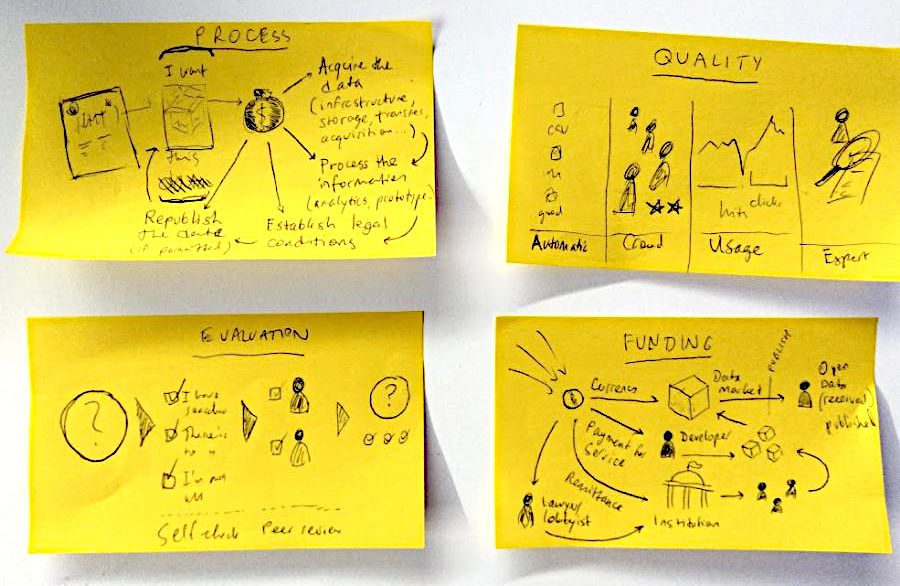

# **earn**

_transitive verb_
- To gain especially for the performance of service, labor, or work.
- To acquire or deserve as a result of effort or action.
- To yield as return or profit.

from [The American Heritage® Dictionary of the English Language](https://www.wordnik.com/words/earn), 5th Edition.

How to earn pocket money gracefully with open data?
---

_Edit this page or raise an [issue](issues/) to add your own thoughts! Or let's have a discussion at [#earnopendata](https://twitter.com/hashtag/earnopendata)_

People who enjoy working with open data are just people: from all kinds of backgrounds and walks of life. We meet online, in cafés, at hackathons, and increasingly in the workplace. We work on our open data projects, share tips and source code, contribute our time willingly to testing or improving datasets and tooling.

Earning money with open data is not a contradiction: it is essential to sustaining the growth of the ecosystem, creating virtuous feedback cycles to improve the breadth of opportunities, and the quality of open data on the whole.

There are also potential overheads to choosing to work with open data, especially if you try to work exclusively with open data sources. Fortunately, as open data gets recognized around the world as a way to higher quality information services, opportunities to hack open data and make money while at it, abound.

If you wish to learn more about open data, consider consulting the [Open Data Handbook](http://opendatahandbook.org/), [Open Data Institute](https://theodi.org/article/what-is-open-data-and-why-should-we-care/), or [Wikipedia](https://en.wikipedia.org/wiki/Open_data).

This community guide is part of the [earn-open-data](README.md) repository, which contains various resources to help get you started in the market of open data. I encourage everyone to try all kinds of strategies, like the ones outlined - there will be unexpected fun. If you have better skills to earn pocket money with open data, welcome to send PR over, I will pick a good merger :)

This guide, which is in the Public Domain, covers the following sections:

- [Key skills](#key-skills)
- [Volunteering](#volunteering)
- [Solo contributor](#solo-contributor)
- [Startup models](#startup-models)
- [Marketplaces](#marketplaces)

Icons by Nithinan Tatah, published at [the Noun Project](https://thenounproject.com/noomtah/collection/geological-exploration/) under a [CC BY 3.0 license](https://creativecommons.org/licenses/by/3.0/us/legalcode).

# Key skills

What do people actually want, when they ask for (and sometimes pay for) open data? As volunteer, freelancer or company, we may try to offer some of the following essential open data skills, and correspondingly qualities.

All data starts with (high quality) **data entry**. In all cases, human beings are involved: whether asking questions with a clipboard in hand, punching responses into an online form, designing and building hardware sensors.

Open data entry, often through online crowdsourcing platforms such as [OpenStreetMap](https://wiki.openstreetmap.org/wiki/How_to_contribute), is at its best highly transparent - and a great way to learn how the system works from the ground up.

Proficiency in open data entry means being able to consistently and actively contribute to data gathering efforts. Excellence is measured in the quantity and quality of contribution, as well as "going beyond" in recognizing gaps in the process such as design flaws or technical bugs, making suggestions for how to improve the interface for everyone.

We talk about **data collection** when we aggregate data from multiple entries or even locations. This means everything from merging two spreadsheets together, to writing web service scrapers that automatically pools the latest content from open data sources. Excellent open data collections are reliable, well tested, accurate, transparent in their construction, easy to use and to reproduce.

Many open data projects start with a data aggregate, and a fundamental skill involved is understanding the qualities of data sources, and how to use them responsibly - legally, within fair use limits, etc. A lot of work is involved in managing and supporting data collection efforts, for example running platforms that collect and republish data, over an extended period of time. Some, like "[awesome lists](https://github.com/topics/awesome-list)", are much easier to manage - yet have a wide ranging impact.

The main goal of most open data initiatives is to make data _actionable_, to use it for producing evidence of transgression or opportunity or both. Open **data analysis** involves exploring data collections or published open datasets with statistics and visualization tools.

Whether done specifically on request of a customer, or in the form of a general-purpose tool enabling the process for other people, analysis of open data can be done in ways that are more or less supportive of the wider mission of open data.

It is the prerogative of many initiatives to spread the skills of data analysis beyond academic institutions, to create widely accessible tools and curricula. Excellent open data analysis is carefully thought through, well documented, reproducible, well designed (attractive, stimulating, interesting), and well positioned to fulfil the intentions of the analyst and the open data community. These are all things that should be taught - and learned - in new ways.

Publishing and **republishing data** is another key skill that is complementary to collection and analysis. Anyone can publish data online today, but it takes a certain finesse to do it well: _legally_ (in full recognition of laws and obligations, with appropriate licenses and terms), _technically_ (compatible with many platforms, easily extendible by others), _accessibly_ (removing barriers of linguistic or technical understanding), etc.

All these are ways that the publication of data contributes to improve the quality of upstream sources, and of the understanding of the topics themselves that are covered by the open data - i.e. the _open knowledge_.

This is a central area of activity for the open data community, and possibly one of the easier ways to get started. For example, you can republish the data from open data portals or Data Packages, such as the one to which this Guide belongs. Often this is the ideal way to stake your interest in supporting a particular kind of open data - and drawing benefits from your involvement.

If there was just one essential skill enabling open data, it would be that of **community building**, which is related to the skills of communication, marketing, evangelism. Open data communities always need more people who apply themselves with interest and professionalism to the task of documenting projects and their progress, spreading word on data publications and analyses, working on cooperation with institutions, sponsors and providers, and just "being there" for newcomers and the curious.

Often one of the simplest and most important jobs of community builders, is to be pioneers - prioritizing topics and sources, exploring the information wilderness, and guiding the attention of the community.

There are definitely other essential skills that we haven't yet covered in this Guide. Feel free to add an [issue](/issue) if you think there's something important we have missed, or even if you just have a question on any of the above.

To summarize: uploading open data in a forgotten corner of the Internet, without encouraging and instructing others to make use of it... is like building a shop in the middle of the ocean. Yes, there is a chance that someone will stumble upon it, but you are very unlikely to see the benefits of having a shop at all any time soon. Community building is a key skill that involves people connecting others, trying to make sense of the whole initiative, and staying around for the long run.

#### Further reading

> _Data is everywhere and affects every decision we make. We want people to use data to make better decisions and be protected from any harmful impacts. To help understand this complex landscape, we have developed a Data Skills Framework to explain what data literacy can mean for you and your team._

-- [Data Skills Framework - Open Data Institute](https://theodi.org/article/open-data-skills-framework/)

> _Errors in data and the tools used to manage it are common enough that there is actually an international organisation called the European Spreadsheet Risks Interest Group that advises on how to reduce the errors people make when using spreadsheets. ESRIG tracks “horror stories” of where data errors in spreadsheets have led to real consequences. These include billions in missing oil revenue, tens of thousands of Olympic tickets being oversold, and huge salaries being given because of accidentally inserted zeros. Some errors are deliberate and criminal. Others are just down to the complexity of managing data. Some errors occur because of the way spreadsheets behave._

-- [A Gentle Introduction to Data Cleaning - School of Data](https://schoolofdata.org/courses/#IntroDataCleaning)

# Volunteering

The act of taking some resource (time or data) to benefit the wider community is fundamental to both volunteering and open data. The focus of this guide is on making the jump (gracefully, of course) from volunteering into commissioned work.

While some of the best open data resources are developed and maintained on a _"pro bono"_ basis, volunteer work is often overlooked as a source of income. In particular, after successfully contributing to an initiative as a volunteer, you should ask for references that can boost your career and lead to better earnings elsewhere. Some companies have policies in place outlining the responsibilities for unpaid internships and volunteering.

In many places, state (official) certification of volunteer work exists. However, open data contributions are commonly not appraised on the same level as, for example, volunteering towards neighbourhood safety. As non-government organizations professionalise and increase their commitment to supporting Open Government Data, we can increasingly expect the possibility of state certification.

In the open data community, a common form of volunteering is participation at hackathons. We wrote this guide during one such hackathon, after intense debate among participants about how to put the words 'money' and 'open data' into the same sentence. Some hackathons offer prizes or cash rewards, but for many people in the open data community, hackathons are just a way to meet like minded others, bring our laptops together, make a meaningful contribution as members of the digital civil society.

Financial incentives and competition should not get in the way of a constructive, supportive, inclusive atmosphere. Nevertheless, hackathons often lead to being introduced to people and projects which could use our continued support. Exposure to the organizations sponsoring these events is an excellent way to understand your future customer, hear about their issues, learn some of the vocabulary of technology and business.

If you don't want to leave your home office, Internet communities for open source such as GitHub also offer a multitude of possibilities for open data contribution. Look for issues that mention open data, or browse through the TODO lists of open data projects, and plug right in. Running your own meetup, such as a mini-hackathon with a group of friends, is another great way to extend your volunteering, engage others in the task, and practice your skills of community building.

#### Further reading

> _Great community leadership accepting the volatility of community. Volunteer communities are a bubbling pot of varying personalities, commitments, skills, and experiences. It is this reason why I often refer to the work of community leaders as “herding cats.” But as leaders we are here not only to lead and inspire our cats, but also to learn to see the patterns
in the chaos that is community._

-- [The Art of Community](https://www.jonobacon.com/books/artofcommunity/) by Jono Bacon

> _Despite being labeled under the common "hackathon" name, their goals vary greatly. Since hackathons are used as a means for work precarization and free labor, the ambiguity of expectations brews potential misunderstanding among participants and stakeholders._

-- [In pursuit of fair co-creation - DINAcon 2018](https://hacknight.dinacon.ch/project/23)

# Solo contributor

A solo contributor is a company of one. For most people (including one of the first authors of this guide), the easiest way to start working with open data has been to work on a freelance basis. There are existing structures in place in most countries, providing legal security and financial safety nets. Open data freelancing is a great opportunity to get in business!

Do not be dissuaded by the formal requirements and obligations of freelancing, such as in regards to social security provisions. It may be useful for you to register in a registry of commerce, also known as [company registry](https://en.wikipedia.org/wiki/Company_register) - one of the earliest forms of open data in the public interest. Check with your local business advice bureau, see if you can find a government website with some guidance about setting up as solo entrepreneur.

The freedom of association that comes with freelancing gives you a chance to test and evaluate partnerships with other people, create potentially a better basis for long term relationships than was possible before the advent of open data sharing - for example:

- **Publish key signs of progress** as freelancer, from a portfolio of open data contributions, to your earnings (even in % change over time).
- **Share your top quality indicators** or success criteria of your projects online. Show what tools you use, explain your methods openly. Practice what you preach.
- **Publish a blog, be active on social media**, talk about your work and the daily challenges it brings. Teaching is the best way to learn.
- **Support your favorite open data resources** by highlighting them on your website, run fundraisers and other appeals for open data initiatives. Be a community champion, and the community will reward you for it.

Most importantly, as a freelancer you need to be able to negotiate and control the costs for your project. There is art and science to this, and successfully managing your work-life-creativity balance is what differentiates weekend warriors from kernel wizards. A data driven approach to managing, planning and communicating your costs could go a long way: use the advantages of being a data-savvy self starter, and freelance your way into the history book of open data legends!

And, at the very least, consider adding some way for people who appreciate your work to sponsor your further activities to your application, website, or data repository. Open the door to kindness, and earnest conversations about what consitutes value for others.

#### Further reading

> _Learning to earn money is a very important thing that will let you know how business is working, helping you understand the company's product logic and laying a solid foundation for your possible technology startup. So I encourage everyone to earn more money, best to try all kinds of postures, there will be unexpected fun. If you have better skills to earn pocket money, welcome to send PR over, I will pick a good merger :)_

-- [@RahulJanagouda/easycents](https://github.com/RahulJanagouda/easycents) (whom we thank as inspiration of this guide)

> _The term ‘digital nomad’ is a popular one these days, referring to people who work online where their chosen work allows them to do so from anywhere. I am not a huge fan of how ubiquitous it has become, and as with anything, it has its dark sides. Barring a new term that emerges from changes to the job market, it remains the most apt label for people who want to live flexibly as self-starters while exploring the world._

-- [Legal Nomads](https://www.legalnomads.com/digital-nomads/)

> _Both Fiverr and Upwork have been criticized for not vetting their freelancers more thoroughly — on both platforms, clients are often inundated with applications from freelancers who are not qualified for the task. This has created an opportunity for smaller platforms that focus on specific tasks and provide access to a heavily-vetted pool of qualified freelancers (e.g. Gigster, Clarity). In response, both Upwork and Fiverr have launched premium products that allow clients to pay for access to a curated pool of freelancers._

-- [Unpacking Upwork’s S-1: Metrics & Lessons for Marketplaces](https://hackernoon.com/unpacking-upworks-s-1-metrics-lessons-for-marketplaces-5c7b69595052)

> _This repo was inspired by [this Hacker News thread](https://news.ycombinator.com/item?id=12773282) about one software developer's experience with Upwork. For all those who have had bad experiences with Upwork, I wanted to create a list of additional resources that software developers can use to find freelance, nomadic and contract work._

-- [@engineerapart/TheRemoteFreelancer](https://github.com/engineerapart/TheRemoteFreelancer)

# Startup models

At some point it starts to make sense to do things as a team. Open data as a model for startups is widely debated, taught, funded and pursued. But we have not yet taken the time to write something here about it here. Some starting points for reference include:

- https://opendataincubator.eu/resources/
- https://www.oreilly.com/ideas/open-data-business-models-deloitte-insight
- https://theodi.org/article/what-do-smes-and-startups-need-to-succeed-in-open-data-innovation/
- https://www.oreilly.com/library/view/open-data-now/9780071829779/

#### Further reading

> _By and large Open Source is how I make a living. .. It is not particularly easy to shake money loose, but I'm making a living and I'm trying to explain to the world that free software is not the same as gratis software._

-- [Reply by @phkamp](https://news.ycombinator.com/item?id=12808833) to [Ask HN: Do you get paid to contribute to a open source project?](https://news.ycombinator.com/item?id=12808429)

# Marketplaces

This guide started with the desire to understand how open data publishers and portals could provide marketplaces for their users, customers, partners and the wider community.

At the [DB Open-Data-Hackathon Summercamp](https://dbmindbox.com/en/db-opendata-hackathons/hackathons/db-open-data-hackathon-community-summercamp-juli-2019/), we thought about what would happened if we married crowdfunding and open data. Imagine [Giveth](https://github.com/Giveth/giveth-dapp)+[JKAN](https://jkan.io/), or [Indiegogo](https://www.indiegogo.com/)+[core datasets](https://github.com/datasets). It might just work :bowtie:

We looked closely into interesting reference projects, like [GitHub Sponsors](https://github.com/sponsors), [Swarm City](https://beta.giveth.io/campaigns/5ce2a6752bb8c0257c7b839e), [Swiss Crowdfunder](https://github.com/200ok-ungleich/swiss-crowdfunder), [GO FAIR](https://www.go-fair.org/go-fair-initiative/), [Algorithmia](https://blog.algorithmia.com/machine-learning-datasets-for-data-scientists/), [Kiva](https://www.kiva.org/), [Iota](https://data.iota.org/#/), [Datapace](https://datapace.io/) and [Wibson](https://medium.com/wibson).

Based on this research we sketched four areas of design which could be pertinent to improving the way open data hubs accelerate the economic potential of working with open data, and reap quality and scaling benefits.

The **Process** of identifying data of interest starts with user requests, proceeds through acquiring the data (setting up storage and hosting infrastructure, organizing the transfer or acquisition), followed by pre-processing the metadata and doing some analytics, establishing the legal conditions and technical details, finally (re)publishing the open data when and as permitted and suitable.

Where these tasks are currently the job of open data teams in government, they could be outsourced or extended to companies, freelancers, and even in some cases volunteers. In each case their worth needs to be well ascertained, and the compensation and attribution of the work better established.

In the **Evaluation** of open data publication and products, there are a series of steps that could be done through self-evaluation, peer review, and automatically. In the open data community we are working on elaborating various criteria of quality, and have experience in developing all three kinds of metrics. Standards bodies have been established with some authoritative purview, such as the [open data certificate](https://certificates.theodi.org/en). High quality evaluations are the basis of quality controls.

A marketplace can establish requirements about the levels of **Quality**, which both provides arguments for participation, and focus to the work of operating the platform itself. Some metrics are the outputs of evaluation processes, others are only possible to establish after the publication was made. We can consider here processes that attempt to quantify quality algorithmically, involve the crowd (ratings) or experts (evaluations) in quality controls, or even just base themselves on Key Performance Indicators like web analytics (view and download counts).

Our focus in further discussion should be on **Funding**, which is at this point the most complicated question to tackle. Putting aside the assumption that "truly open data is free", we can look into the improvements that could be achieved through currency exchange in an open data context. In other words, what could we spend money on, if we built a marketplace? Here are some ideas:

- Engaging activists, lawyers, lobbyists in pressuring institutions to open their data.
- Financial remittance, i.e. compensation, for the costs of data publication provided to institutions.
- Involving more people in the data publication process.
- Paying developers to improve the publication process, or even make use cases for specific open datasets.
- Involving more people in use case development, for example by sponsoring hackathons.
- Reducing the friction of using open data, such as by enabling easy access to premium services through data portals.

Edit this page or raise an [issue](issues/) to add your own thoughts! Or let's have a discussion at [#earnopendata](https://twitter.com/hashtag/earnopendata)

#### Further reading

> _individually or in groups we can take action now to create Open materials, whether software, databases or content with the intention of both delivering immediate value and acting as exemplars of the potential of Openness. A fundamental shift in the public conception of information, recognizing the benefits of sharing rather than hoarding, needs to be matched by political pressure to fund Open information; to establish disbursement processes, including the creation of remuneration rights as legal entitlements and the mechanisms for licensing and dispute settlement; and to make international agreements instituting Open policies._

-- [@rufuspollock](https://github.com/rufuspollock)/[The Open Revolution](https://openrevolution.net/)

> _Hire us to build and improve your data-driven project. We have decades of experience building data systems for clients large and small. Our team of talented developers and managers can help you to design, build or enhance your data project._

-- [Datahub.io home page](https://datahub.io/)

> _In general, the data published as OGD are those for which there is wide demand and which can be reused by a number of people. By contrast, datasets that were created in response to a specific customer request do not normally constitute OGD._

-- [Swiss Open Government Data Handbook](https://handbook.opendata.swiss/en/identify/identifying.html)
