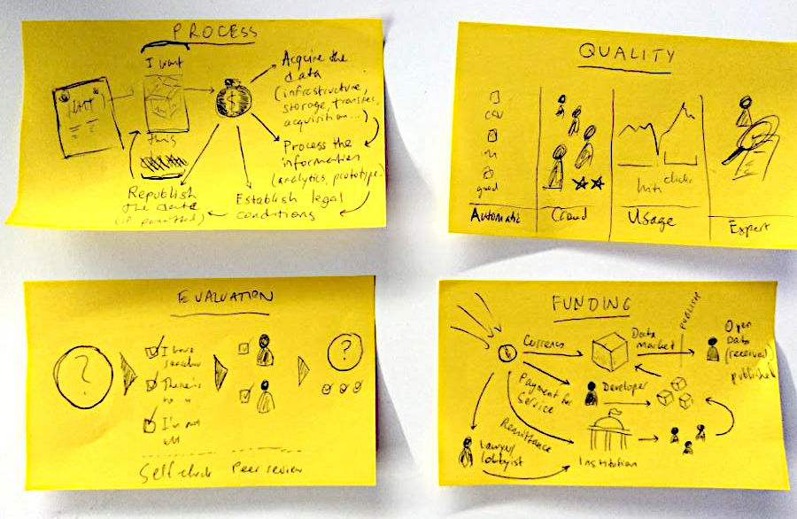

#earnopendata
---

This repository describes strategies and links to resources on earning an income with open data.

Seeded at the [DB Open-Data-Hackathon Summercamp](https://dbmindbox.com/en/db-opendata-hackathons/hackathons/db-open-data-hackathon-community-summercamp-juli-2019/) in July 2019, our original idea was to create a resource to strengthen the basis for professional engagement within the open data community.

See our experimental jobs board at: **[jobboard](/loleg/jobboard)**

# Guide

A short overview exists here on the different modes of work, and how value is created in the open data community, with tips on:

- What skills and qualities are involved in open data
- Appraising volunteer work (hello, hackathons!)
- Freelancing: open data as a solo contributor
- Open data models for startups
- Improving the marketplace

Read more in: **[How to earn pocket money gracefully with open data?](GUIDE.md)**

# Can I support you?

Yes, you can [support this initiative](https://www.patreon.com/sodacamper) on Patreon.

Contributions of advice, pull requests and :star: GitHub stars are cool too :)

# Data

This is a [Data Package](https://frictionlessdata.io/data-packages/) tracking some active centres of value exchange (data hubs, or marketplaces), where services of creating, improving, or building on top of open data are valued and usually well compensated. It is inspired and partly based on [@engineerapart/TheRemoteFreelancer](https://github.com/engineerapart/TheRemoteFreelancer).

To view the data, click the link above. To contribute, edit the files in the `data` folder.

For more information on how Data Packages work, visit [frictionlessdata.io](https://frictionlessdata.io/guides/data-package/) and [datahub.io](https://datahub.io/docs/data-packages/publish-faq).

# Team

- Oleg ([@sodacamper](https://twitter.com/sodacamper))
- Michael ([@mibi61](https://twitter.com/mibi61))

# License

This repository is made available by its maintainers under the [Public Domain Dedication and License v1.0](http://www.opendatacommons.org/licenses/pddl/1.0/), a copy of the full text of which is in [LICENSE.md](LICENSE.md). Forks, contributions and [feedback](issues/) are welcomed.
